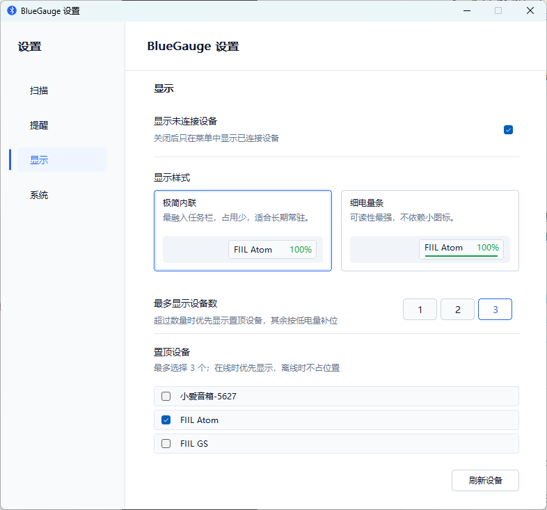

# BlueGauge

BlueGauge 是一个 Windows 10/11 原生轻量级蓝牙电量监控工具。它常驻系统托盘，用来查看蓝牙设备连接状态和电量，并可在任务栏显示常用设备的电量信息。

它的定位不是完整的蓝牙管理器，而是一个安静的小状态提示：需要时能看见，不需要时尽量不占地方、不打扰、不引入大型依赖。

项目使用 C++20 与 Win32/GDI 实现，不依赖 WPF、WinUI 或大型 UI 框架，目标是保持体积小、启动快、界面简洁。 构建的 exe 约 646 KB,适合作为一个长期常驻的小功能使用。

## 预览

设置页可预览任务栏电量显示样式，并管理置顶设备、刷新入口和提醒选项。

## 功能

- 系统托盘常驻，支持自绘托盘菜单和设备列表。
- 任务栏电量显示，支持“极简内联”和“细电量条”两种样式。
- 支持置顶设备，最多优先显示 3 个常用设备。
- 使用真实蓝牙连接状态判断，未连接设备不会显示到任务栏。
- 支持蓝牙设备变化事件触发刷新，并保留定时扫描作为兜底。
- 设置页可调整刷新间隔、低电量阈值、任务栏显示样式、置顶设备和提醒开关。
- 支持低电量提醒和连接/断开变化提醒。
- 支持开机自启、手动刷新、检查更新、单实例运行和本地日志。

## 致谢

BlueGauge 的思路参考了 [SpLlry/SplusXBTMeter](https://github.com/SpLlry/SplusXBTMeter)
