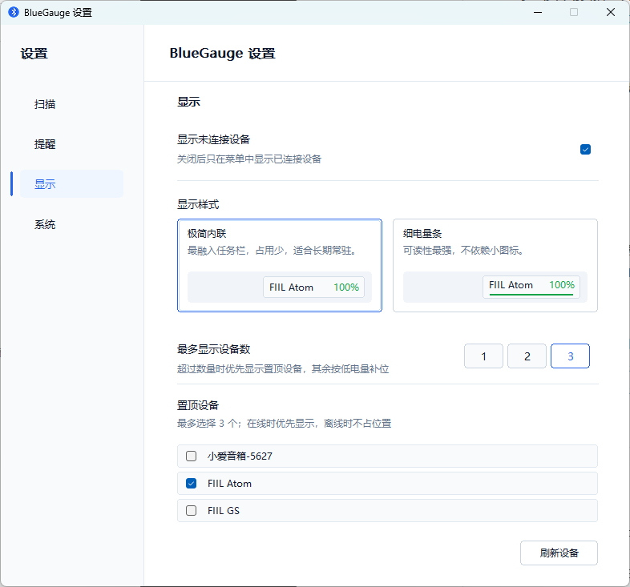

# BlueGauge

BlueGauge 是一个 Windows 10/11 原生轻量级无线设备电量监控工具。它常驻系统托盘，用来查看蓝牙和 2.4G 设备的连接状态和电量，并可在任务栏显示常用设备的电量信息。

它的定位不是完整的蓝牙管理器，而是一个安静的小状态提示：需要时能看见，不需要时尽量不占地方、不打扰、不引入大型依赖。

项目使用 C++20 与 Win32/GDI 实现，不依赖 WPF、WinUI 或大型 UI 框架，目标是保持体积小、启动快、界面简洁。构建的 exe 不到 1 MB，适合作为一个长期常驻的小功能使用。

## 预览



设置页可预览任务栏电量显示样式，并管理置顶设备、刷新入口和提醒选项。

## 功能

- 系统托盘常驻，支持自绘托盘菜单和设备列表。
- 任务栏电量显示，支持“极简内联”和“细电量条”两种样式。
- 支持置顶设备，最多优先显示 3 个常用设备。
- 支持给设备重命名，自定义名字在任务栏、托盘和提醒里同步生效。
- 同时覆盖蓝牙设备和通过罗技接收器连接的 2.4G 设备。
- 使用真实连接状态判断，未连接设备不会显示到任务栏。
- 支持蓝牙设备变化事件触发刷新，并保留定时扫描作为兜底。
- 设置页可调整刷新间隔、低电量阈值、任务栏显示样式、置顶设备和提醒开关。
- 支持低电量提醒和连接/断开变化提醒。
- 支持开机自启、手动刷新、检查更新、单实例运行和本地日志。

## 电量来源

三类设备走三条完全独立的读取路径：

| 设备类型 | 读取方式 | 电量来源 |
| --- | --- | --- |
| BLE | WinRT GATT | Battery Service `0x180F` / Battery Level `0x2A19` |
| 经典蓝牙 | PnP 设备属性 | `{104EA319-6EE2-4701-BD47-8DDBF425BBE5}` 属性 2 |
| 罗技 2.4G | HID++ 2.0 长报文 | feature `0x1000` BatteryStatus，回落 `0x1004` UnifiedBattery |

2.4G 设备挂在 USB 接收器下、走 HID 栈，不在蓝牙设备类里，因此需要单独枚举。程序会找出罗技接收器的 HID++ 长报文集合（`UsagePage 0xFF00`，收发均 20 字节），逐个探测设备索引 1-6。覆盖 Lightspeed / Unifying / Bolt 接收器，目前实测过 Lightspeed（G304）。

## 已知限制

- **非罗技的 2.4G 设备读不到电量。** 通用的 HID Battery Strength 用法（`UsagePage 0x06` / `Usage 0x20`）极少被外设声明，而各家的私有协议未公开。
- **HID++ 返回的是离散档位而非连续百分比。** 设备通常只上报 90 / 50 / 20 / 5 这类台阶，所以低电量阈值只在跨越档位时触发，中间不会平滑变化。
- **休眠或未配对的 2.4G 设备不会出现在列表里。** 判定依据是 HID++ ping 是否有应答。
- 部分蓝牙设备不实现电量上报，此时列表显示“未知”。

## 构建

需要 Visual Studio 2022 或更新版本（含「使用 C++ 的桌面开发」工作负载）、Windows SDK 和 CMake 3.25 及以上，目标平台 x64。

```bash
cmake --preset x64-release
cmake --build --preset x64-release
```

也提供 `x64-debug` 预设。两个预设均使用 Ninja 生成器，产物在 `out/build/` 下。

## 配置与日志

| 用途 | 路径 |
| --- | --- |
| 配置 | `%APPDATA%\BlueGauge\config.ini` |
| 日志 | `%APPDATA%\BlueGauge\logs\app.log` |

配置项都能在设置页里改，一般不需要手工编辑。刷新间隔可选 5-3600 秒（默认 10），低电量阈值 1-100（默认 20），任务栏最多显示 1-3 个设备。设备的自定义名字存在 `[DeviceNames]` 段，最多 32 条，单个名字上限 24 字符。

日志超过 1 MB 会转存为 `app.log.old`，只保留一份。排查读不到电量的问题时，日志里会记录每个设备的连接状态判定和电量读取失败原因。

## 致谢

BlueGauge 的思路参考了 [SpLlry/SplusXBTMeter](https://github.com/SpLlry/SplusXBTMeter)
